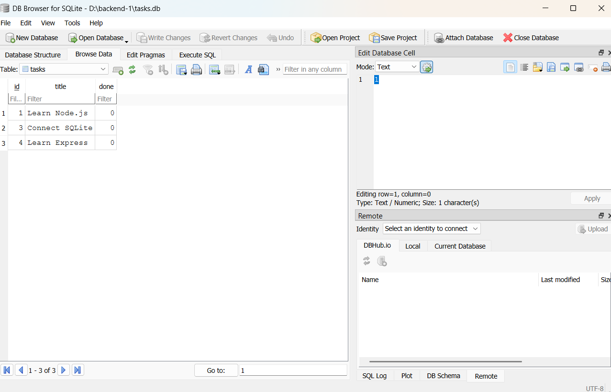
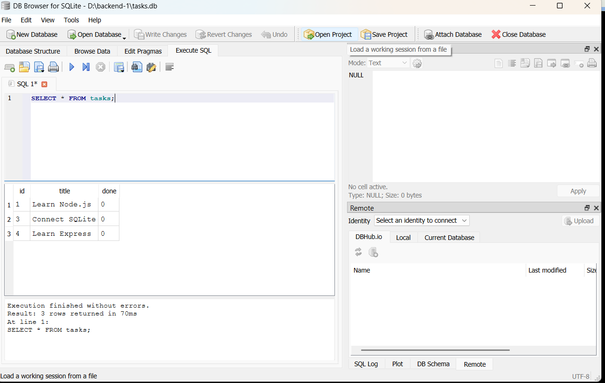

# Task CRUD API with SQLite

A simple CRUD REST API built with Node.js, Express, and SQLite.

## Project Overview

This project started as a CRUD API that stored tasks in an in-memory array.

The data disappeared whenever the server restarted.

SQLite was introduced as a persistent data layer so that tasks survive server restarts.

The architecture is:

Client → Express API → SQLite database

The API endpoints remain the same while the storage implementation changed from an in-memory array to SQLite.

## Technologies

- Node.js
- Express
- SQLite
- better-sqlite3

## Database

The application uses SQLite because it is lightweight and does not require a separate database server.

The database file is:

`tasks.db`

It is automatically created when the application starts if it does not already exist.

The `tasks` table is also automatically created.

If the table is empty, three example tasks are inserted:

- Learn Node.js
- Build a REST API
- Connect SQLite

## API Endpoints

### Get all tasks

`GET /tasks`

### Get a single task

`GET /tasks/:id`

### Create a task

`POST /tasks`

Example request:

```json
{
  "title": "Learn Express"
}


# screenshot of db viewer and a query executed

